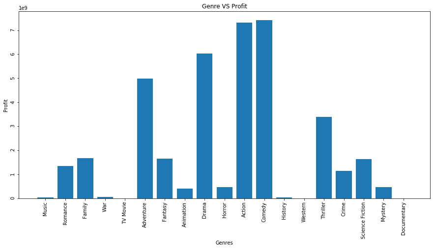
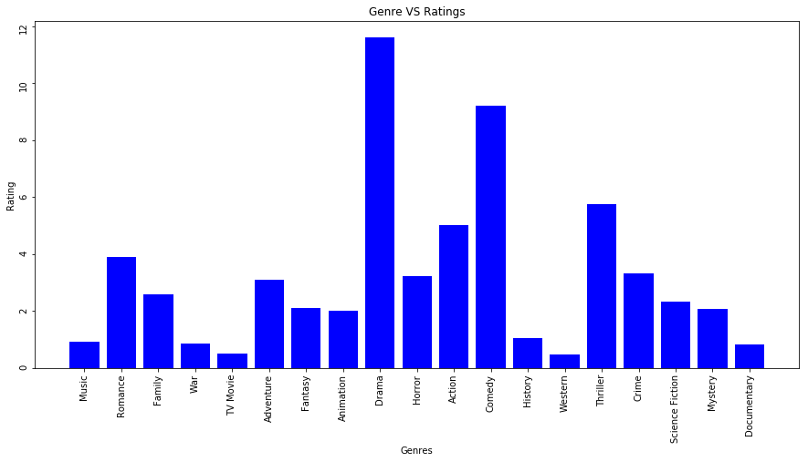
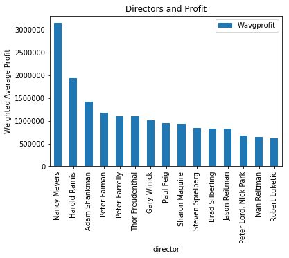
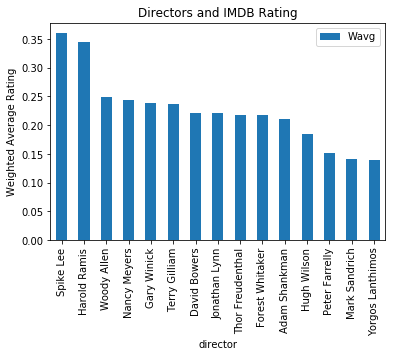

# Movies Database Project

## Intro

We pulled data from OMDBapi.com, The-numbers.com, and themoviedb.org to test the effects that Genre, Director, and Actor had on a movie's overall succes. We judged overall success using profit and imdb ratings.

## Our Process

We used webscrapping and api calls to collect and clean the data. Then we uploaded the data to an AWS database. Using MySQL we connected to the AWS database and queried to create useful tables.

We used a weighted average when calculating the effects that a Genre, Director, or Actor might have on movie success. Because our sample size wasn't as big as we would have liked, a weighted average was necessary to offset the impact that one extremely successful movie might have on the average profit or rating of, for example, an actor who was only in one movie.
    
    Our formula for weighted average was:
    
    ((number of movies for genre or actor or director) / (total number of movies)) * (average profit or rating for that genre or actor or movie) 

## Our Data

Our sample size was 760 movies
The range of movie years was from 1915 to 2019*
However, the bulk of our movies was in the 1990's
This definitely had a strong impact on our results (which you will see later)

For Genres:
We took every movie in each genre, and looked at which genre had the highest profits and highest ratings (again, factoring in weighted average). Our data showed that Comedies were the the most successful genre.

For Directors and Actors:
Due to the above, we chose to look only at Directors and Actors that worked in Comedies. Of those Actors and Directors we queried the top fifteen of each in profits and ratings (still, using our weighted average).

## Conclusions:

We found that Comedies were the most successful Genre. Nancy Meyers was the most successful director in the comedy genre. Mel Gibson was (somehow) the most successful actor in the comedy genre.

